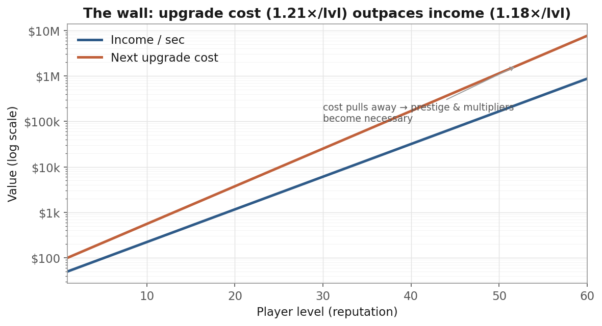
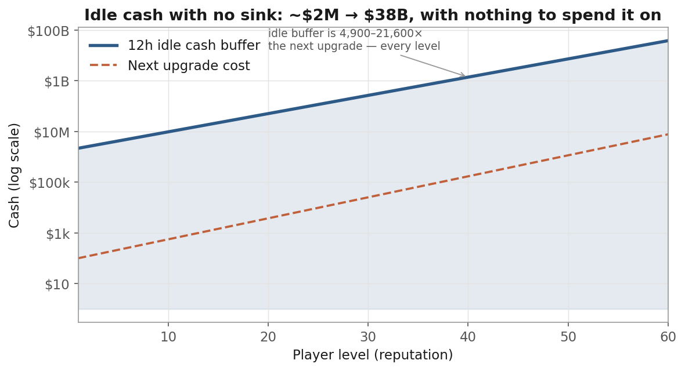
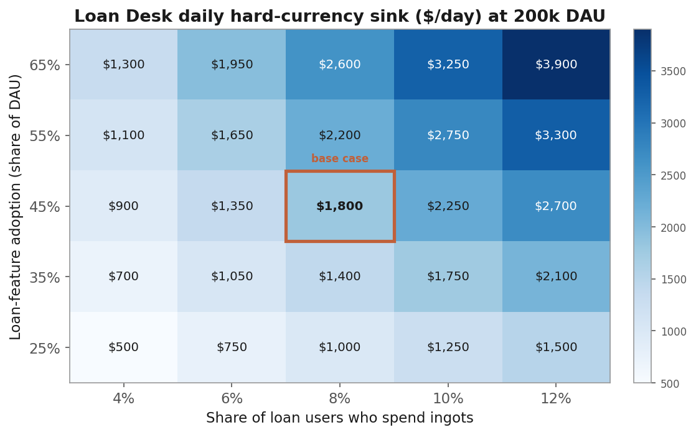

# Idle Bank Tycoon — Game Economy Design Case Study

A self-directed economy-design study for the Game Economy Designer role at Kolibri Games (Idle Bank Tycoon team). It models two economy levers, a late-game liquidity-lock mechanic and rewarded-ad tuning, each as a parameter-driven model with ROI and monetisation math, a sensitivity analysis, and an A/B test plan.

**📊 [The model: `Idle_Bank_Tycoon_Economy_Model.xlsx`](./Idle_Bank_Tycoon_Economy_Model.xlsx)**  ·  **📄 [Full case study (PDF)](./docs/case-study.pdf)**

---

## Summary

Idle Bank Tycoon is a commercial success: third in revenue across Kolibri's portfolio, strong D1 retention (~48%), and a young, ad-tolerant audience. Its growth constraint is late-game depth and monetisation efficiency, not acquisition. This study models two levers, one for each.

| Opportunity | The problem (sourced) | The lever | Modelled outcome\* |
|---|---|---|---|
| **A. Loan Desk** | Players accumulate idle cash with no compelling late-game sink (flagged by AppQuantum). | A liquidity-lock engagement mechanic. Lock idle cash for a fixed term in exchange for a temporary income boost. The currency sink is hard-currency early-repay and extra slots. | An engagement hook plus a hard-currency spend path. **+$0.009 ARPDAU** from the ingot sink alone; the retention value is larger but must be measured. |
| **B. Ad tuning** | Monetisation is ad-led (US IAP RPD ~$0.6), but rewarded rewards are not scaled to progress and placement is untuned. | Scale the rewarded reward to the player's income. Lift opt-in views per day. Resequence interstitials, with no new forced ad breaks. | **+23%** sourced rewarded-ad lift, modelled up to **+41.7%**. **+$0.019 ARPDAU**. |

At the model's default 200k DAU, the two levers lift blended ARPDAU from $0.180 to $0.208 (+15.5%), on the order of $2M incremental annual revenue at static DAU. The Loan Desk's larger payoff is retention — it gives late-game players a decision to make and should lift D7 — but that has to be measured, not modelled. Both ship as A/B tests with retention guardrails, so they can be rolled back.

<sub>\*Illustrative output of the companion model at its default assumptions. The +41.7% rests partly on an assumed rise in opt-in views (see Opportunity B); only the +23% placement effect is sourced. See *Data & assumptions* below.</sub>

---

## Context: what shapes the work

- **It is ad-led, not whale-led.** AppQuantum estimates US IAP revenue-per-download at ~$0.6, with 51% of users male and under 25. Rewarded video carries the revenue.
- **Retention is already strong (D1 ~48%).** The opportunity sits in the mid-to-late funnel (D7+) and in revenue-per-user.
- **The late game lacks sinks.** AppQuantum's deconstruction recommends meta-depth and alternative soft-currency uses. Players reach a point where they hold far more cash than anything available costs.

---

## The baseline: the cash-surplus problem

An idle economy runs on two curves. Cost rises exponentially (1.21×/level). Income rises more slowly (1.18×/level). Cost always overtakes income, which is what makes multipliers, milestones, and prestige necessary. (Production is classically modelled as linear in units owned; here it is modelled per level, where each level is roughly a fixed step of progress. On a log axis both curves are straight lines.)



The 12-hour offline cap lets cash accumulate between the few upgrades that matter. Bank the offline buffer at each level's income rate and compare it to the next upgrade's cost: the idle buffer sits at 4,900–21,600× the next upgrade cost at every level, and grows from about $2M to about $38B in absolute terms.



The player holds far more cash than there is anything to spend it on. Opportunity A locks that surplus into timed loans. Opportunity B converts the same engagement into more rewarded-ad revenue, without changing the core balance.

---

## Opportunity A. The Loan Desk (a liquidity lock with a hard-currency sink)

The concept is native to a bank. The player issues a loan by locking a share of idle cash for a fixed real-time term. While the loan runs, income per second is boosted, so it reads as earning interest. At maturity the full principal returns plus a small bonus — so on soft currency the feature is deliberately a *faucet*, not a sink. What it does for the soft economy is remove liquidity and give late-game players a decision; its monetisation, and its only true currency sink, is the Gold Ingots players spend to end a loan early or to unlock extra daily slots.

**Worked example, mid-game player (~level 30):**

| Step | Value | Note |
|---|---|---|
| Income / sec | ~$6,075/sec | Linked from the Baseline tab. |
| 12h idle buffer | ~$262M | The surplus available to lock. |
| Loan principal (40% of idle cash) | ~$105M | Scales with the player, so it cannot be gamed by hoarding. |
| Income boost (1.5× for 4h) | $6,075 → $9,113/sec | The interest, paid as extra flow. |
| Extra cash over the 4h term | ~$43.7M | The incremental reward versus not taking the loan. |
| Boost reward as % of normal 4h earnings | 50.0% | A 1.5× boost over 4h equals half-again normal earnings. |
| Early-repay fee | 25 ingots | Rushing costs hard currency and never generates it. |

Principal and boost are both percentages of live income, so the shape holds at every level (illustrative): an early ~Bank 10 player at ~$220/sec locks a ~$3.8M loan; a late ~Bank 50 player at ~$166k/sec locks a ~$2.9B loan — the 50% boost-to-earnings ratio is invariant by construction. I also stress-tested the design knobs themselves (boost 1.25–2.0×, term 2–8h, principal 25–50%): none breaks the guardrails, because the boost cap contains soft inflation and the hard-currency sink scales with adoption rather than tuning.

**Six balance guardrails (anti-exploit, anti-inflation):**

1. Principal is a percentage of the live balance, so it grows with the player and resists hoarding.
2. The reward is extra income over time; it never touches permanent power or prestige math, so there is no pay-to-win.
3. The boost reward stays modest (50% of normal 4h earnings), so loans complement active upgrading instead of replacing it. This is the rule that prevents cannibalisation.
4. Every accelerator costs hard currency. None of them prints soft currency.
5. Free slots are limited, so the feature cannot dominate a session. Extra slots are a paid sink.
6. On soft currency the Desk is a faucet by design, so it does not fight inflation on its own — that stays the cost curve's job (1.21×/level). Its anti-inflation control is the cap on the boost (50% of normal earnings); its monetisation is the hard-currency sink.

The split is the point: the soft boost buys the engagement, the hard-currency accelerators do the monetising. The feature earns its place on the D7 lift it should produce, not on the $0.009 sink — which is the small half of its value.

---

## Opportunity B. Rewarded-ad reward tuning

The audience is young, low-spend, and ad-tolerant. Idle games serve about 73 rewarded videos per user, among the highest of any genre. The quickest revenue gain comes from getting more out of the rewarded economy we already run. The model changes two things and adds no new forced ad breaks:

- **Scale the reward to the player's income.** A reward worth "30 minutes of your current income/sec" stays meaningful from Bank 1 to the late game, where a flat reward becomes trivial as numbers grow. (Weber–Fechner: a reward is judged by its ratio to current income, so it has to scale.)
- **Resequence placement.** Showing an interstitial after a rewarded offer lifts ad ARPDAU by about +23% in industry tests. It also adds an impression at a sensitive moment, so this is the one change that can cost retention — it ships only behind a D1 and session-length guardrail.

Holding the audience constant (same ad-watcher share, same eCPM):

| Metric | Baseline | Tuned | Δ |
|---|---|---|---|
| Rewarded views per watcher / day | 6.0 | 8.5 | +41.7% |
| Daily rewarded ad revenue (200k DAU) | ~$9,108 | ~$12,903 | +$3,795 |
| Incremental rewarded ARPDAU | $0.0455 | $0.0645 | +$0.019 |

Read this as a floor and an upside. The +23% resequencing lift is the *sourced* figure, from industry tests. The 6.0 → 8.5 jump in opt-in views is a *modelling assumption* — better-sized rewards should raise willingness to watch — and on its own it is what produces the +41.7% rewarded-video figure in the table. So +23% is what I would underwrite and +41.7% is the modelled ceiling, with the A/B test deciding where it lands between them.

---

## Combined impact and sensitivity

| Lever | Incremental ARPDAU | Source in model |
|---|---|---|
| Baseline ARPDAU | $0.180 | Parameters (current blended) |
| + Loan Desk (A) | +$0.009 | Hard-currency sink ÷ DAU |
| + Ad tuning (B) | +$0.019 | Tuned − baseline rewarded ARPDAU |
| **Projected new ARPDAU** | **$0.208 (+15.5%)** | ≈ $2M incremental annual revenue at static DAU |

That +$0.009 counts only the hard-currency sink and misses the feature's real case, which is retention. As a rough order of magnitude: on a $0.18 ARPDAU base, a +1pt move in D7 lifts average lifetime enough to be worth on the order of $0.005–$0.02 ARPDAU-equivalent — comparable to or above the sink itself. It has to be measured, not modelled, which is exactly why A ships as a test.

The model includes a live two-variable sensitivity grid for the Loan Desk's daily sink across adoption and ingot-spender share. At the base case (45% / 8%) the sink is about $1,800/day. Across reasonable swings it spans roughly $500–$3,900/day, so the headline holds.



---

## Validation: the A/B test plan

Nothing ships on the model's projection alone; every change is gated by an A/B test:

- **Hypotheses.** (A) The Loan Desk lifts D7 and ARPDAU without hurting D1. (B) Income-scaled rewards and resequenced interstitials lift ad ARPDAU with neutral-or-positive retention.
- **Design.** Assign at install (new players only). Split by platform, since iOS and Android behave differently. Test 4–5 variants of reward size and loan multiplier, sweeping the range to find the tuning curve.
- **Primary KPIs.** Evaluate retention and ARPU together, because tightening an economy often trades one for the other. Define the lever metric (loan adoption %, views/day) and require ≥3% ARPDAU movement before acting.
- **Guardrails.** Run the full 14-day retention window. Do not stack two tests on the same system. Watch the cash-balance distribution for inflation, and watch D1 and session length against the resequenced interstitial — that placement is the main retention risk and rolls back if D1 drops.
- **Decision rule.** Ship if D7 is up or flat and ARPDAU improves by ≥3%. Iterate if results are mixed. Stop if D1 drops or the sink triggers progression complaints.

---

## How the model is built

Change one input and every dependent value recalculates.

- **One parameter tab drives everything.** Every input lives on a Parameters tab (blue cells). Every downstream value is a single linked formula off that tab (400+ of them), with no hard-coded results. Change the cost-growth rate or the eCPM once and the whole model rebalances.
- **Seven tabs.** README, Parameters, Baseline Economy (the core-loop curves and the surplus problem), Loan Desk (A), Ad Tuning (B), KPI Impact (combined view, sensitivity grid, A/B plan), Sources.
- **Documented assumptions.** A Sources tab separates the external data points (third-party, directional) from the modelling assumptions.

To explore it: open the workbook, go to the Parameters tab, and change any blue cell. Everything else recalculates.

---

## Repository contents

```
IdleBankTycoonCaseStudy/
├── README.md                              ← this case study
├── Idle_Bank_Tycoon_Economy_Model.xlsx    ← the working model (change a blue cell)
├── docs/
│   └── case-study.pdf                     ← full written case study
└── charts/                                ← figures used above, exported from the model
    ├── 01-income-vs-cost.png
    ├── 02-idle-cash-surplus.png
    └── 03-loan-sensitivity.png
```

---

## Data & assumptions

Kolibri does not publish per-level cost tables or live KPIs, so every core-loop number here is a labelled assumption, calibrated to public third-party estimates and standard idle-game math. The contribution is the method; the specific figures are placeholders for Kolibri's telemetry. Swapping in their real numbers would make the model production-grade without changing its structure.

External data points (directional, third-party): AppQuantum / Sensor Tower (Nov 2023) for revenue, audience, and D1; Unity (2024) for IAP conversion; Moloco (2025) for payer concentration; Appodeal (2025) for ad engagement; GameAnalytics (2024) for session and retention norms; A. Pecorella, "The Math of Idle Games" (GDC) for idle math; the Machinations Manifesto (with E. Castronova, GDC 2023) for the currency-stability and price-rationality framing. Modelling assumptions (cost and income growth, base values, DAU, loan parameters, eCPM) are tuned to those references and labelled on the Sources tab. None of the figures are Kolibri's internal data.

---

## About

**Meriç Erler** · Data Analyst, Game Economy & F2P Systems · Berlin
Portfolio: <https://merogith.github.io/Portfolio/>
